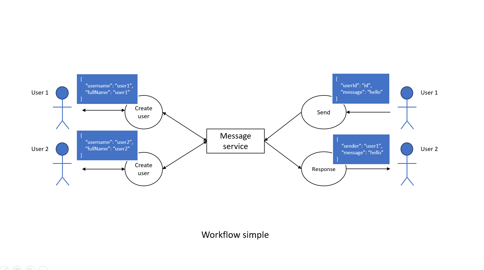

# Example websocket

# Getting Started

## Java 17 + Spring boot + Elasticsearch


```code

CONNECT
accept-version:1.1,1.0
heart-beat:10000,10000

^@


SUBSCRIBE
id:sub-1
destination:/topic/products

^@

SEND
destination:/app/products.save
content-type:application/json

{"name":"iPhone 15","price":"999","description":"IPHONE"}^@

SEND
destination:/app/products.getAll

^@

SEND
destination:/app/products.findById

^@

UNSUBSCRIBE
id:sub-1

^@

```

# System context diagram


